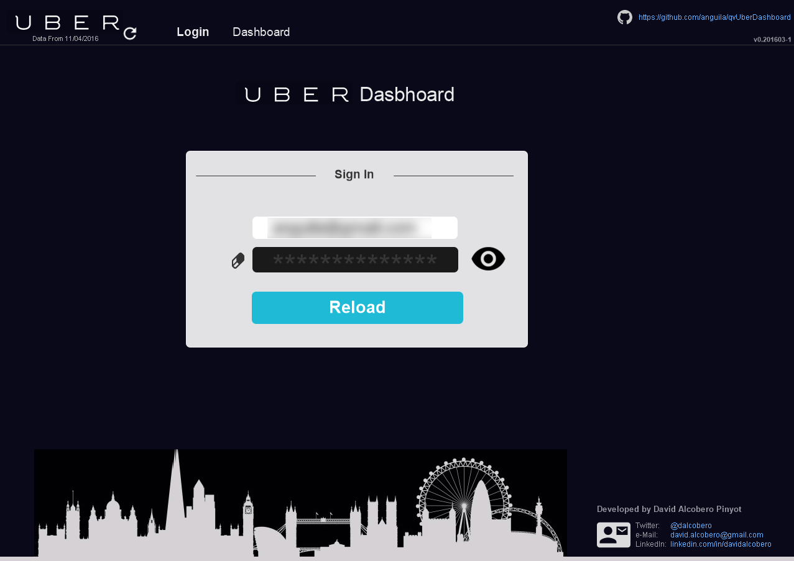
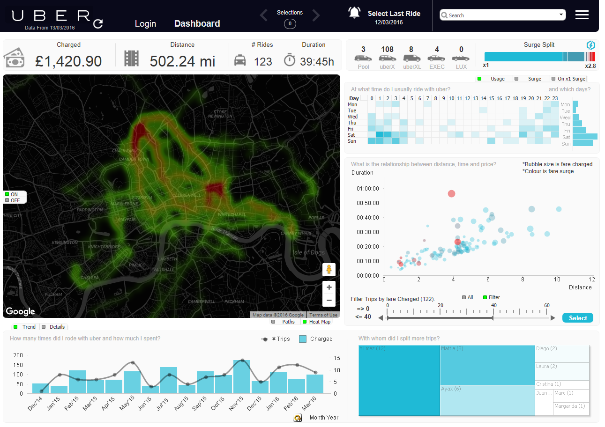
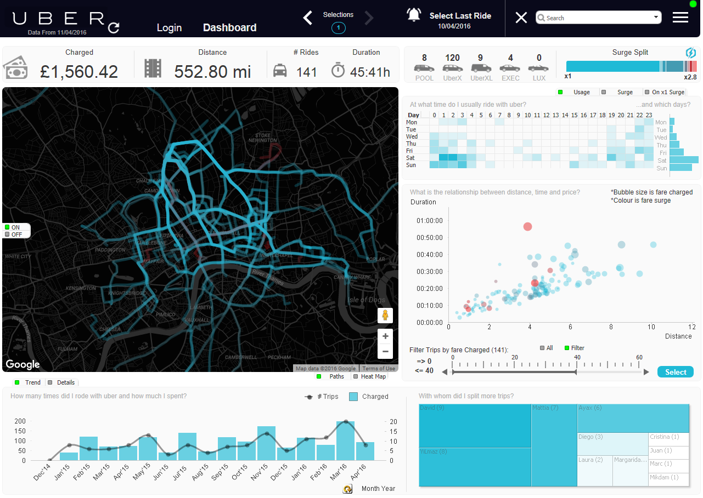
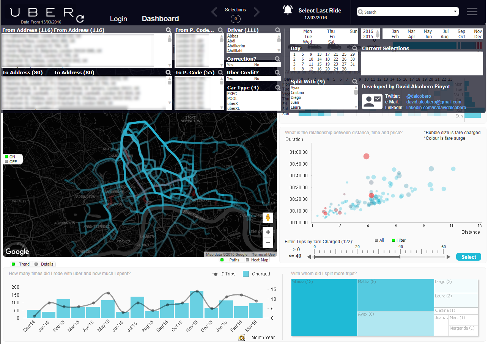
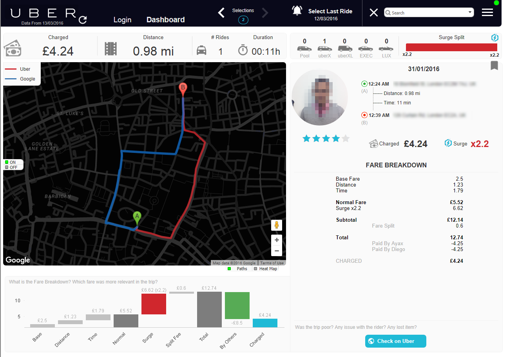

# qvUberDashboard
> QlikView app to Analyse your Uber trip data and usage.

Have you ever wondered how much you spent so far in Uber? What would it look like to overlap all your trips? The impact of the fare surges in your final charged price? With whom did you split more trips? Your trend usage or hourly usage pattern? I'm sure you did. And I did too :) That's why I created this App.


Well, to be honest, all started in a pub. As many good stories.. I was chatting around with some friends, complaining about me always going to their area instead of finding a middle point. They said that's not true.. I was unable to prove it back at those days, not anymore.. :) 


Data is among all of us, and we are data as well. Sometimes we can get something useful and meaningful of it. I hope this help you to understand (and forecast?) your Uber usage. And who knows, maybe you can challenge some friends too..  

**Note: This code is provided for reference and personal purposes only.**

Features
--------
- Multi-currency support (£, $ and €)
- Multi country support
   - Tested only in: UK, FR and US (CA)
- Usage trend
- Overall trip view in google maps
- Heat map view in google maps
- Trip usage and surge day/hour heatmap
- Surge split
- 'Shared with' ranking
- Trip deviation against google directions route (in trip details)
- Different car support: UberPOOL, UberX, UberXL, UberExec and UberLUX.
- Flag trips with some fare corrections (by Uber), Uber credit or promotions.
- Fees/Fares included:
   - Fare Charged, Base, Normal, Surge, Distance, Time, Subtotal, Uber Credit, Minimum Fare, Total, Split Fee, Split Paid, Rounding Down and  Safe Rides


## Installation
0. Install Qlikview (if required):
   [http://www.qlik.com/try-or-buy/download-qlikview](http://www.qlik.com/try-or-buy/download-qlikview)

1. Install Uber Map qvw Extension (double click on .qar file):
   ```sh
   Uber Google Maps Javascript API v3 Toolkit 2.qar
   ```
   Extension based on GoogleMapsAPIv3Toolkit and slightly modified to enhance the map to display Uber trips
   [https://github.com/rvspt/GoogleMapsAPIv3Toolkit-QV](https://github.com/rvspt/GoogleMapsAPIv3Toolkit-QV)

2. Install NodeJs:
   [https://nodejs.org/en/download/](https://nodejs.org/en/download/)


3. Install missing libraries (when required). Open a terminal (cmd.exe) and in the qvUberDashBoard Folder:
   ```sh
   cd extractor/
   npm install
   ```

## How it works
When the qvw app is reloaded, the credentials from the login page are used to call a nodejs application in a terminal. This app, connects to Uber website with that username/password and retrieves the html data of every single trip (visiting each page as you would do in the browser). 
For each trip, it parses the HTML from the detail page to create a js class with all the trip attributes (ie: coordinates from google static map, fare charged, normal fare, surge, split with, origin/destination, etc..) and then it dumps all that info into out/UberData.txt.

After this point, QlikView reads the .txt file to create a star-scheme data model, with a trip centric fact table. Some conversions and calculations are done in the script to ease the calculations in the QlikView layout.


*The Uber-extractor is based on [https://github.com/chriswhong/Uber-trip-script](https://github.com/chriswhong/Uber-trip-script) (which was inspired on [https://github.com/joshhunt/Uber](https://github.com/joshhunt/Uber) )*


## Screenshots
Login


Dashboard with Heatmap


Dashboard with Trip Paths


Filters on the top


Trip Details



Change log
--------
- v201603-01 (16/03/2016)
   - Bugfix in extractor to load uber accounts with only one single page.
   - Logging system added (in login page, when error comes out, a log icon is enabled to be able to see log details in Qlikview)
   - Validation to detect accounts with no trips (uberData.txt exists, but no trips inside).


## Meta

David Alcobero:
- [@dalcobero](https://twitter.com/dalcobero) 
- [LinkedIn](https://uk.linkedin.com/in/davidalcobero) 
- david.alcobero@gmail.com

TMFWLP.

## License

Distributed under the MIT license. See ``LICENSE`` for more information.

[https://github.com/anguila](https://github.com/anguila)
